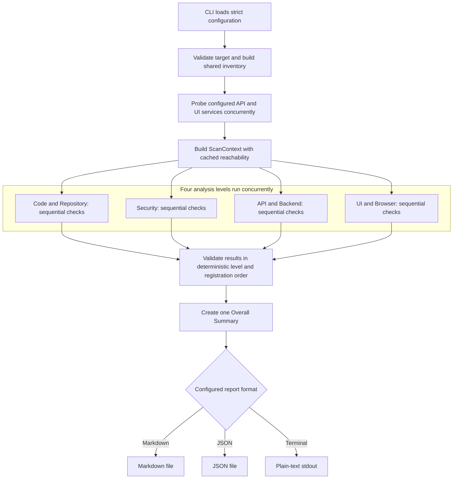
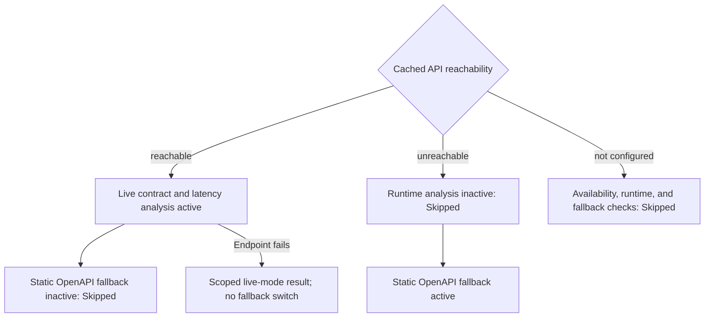
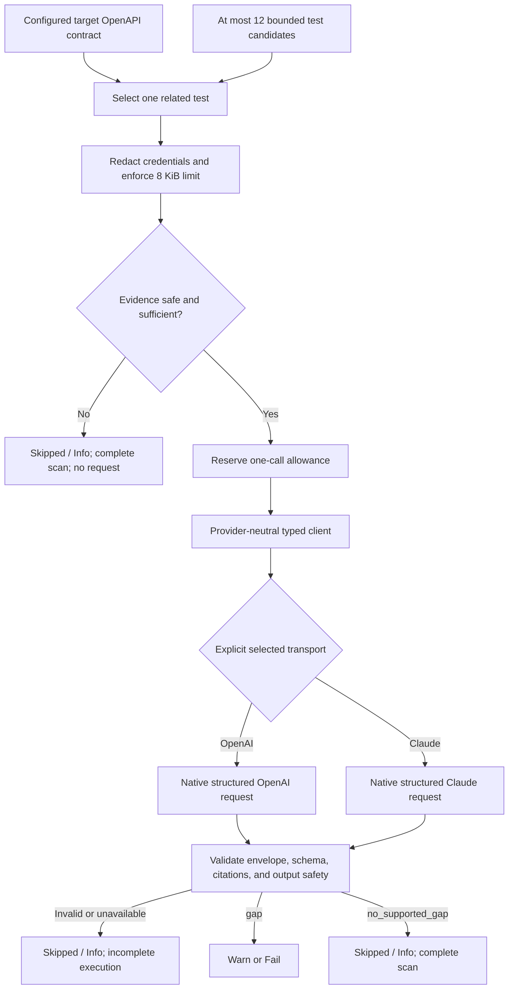

# Sentinel Architecture

## Goal and Implemented Scope

Sentinel is a TypeScript CLI that scans a readable local project and produces
one actionable quality report. The implemented MVP favors bounded,
explainable checks and graceful degradation over broad but shallow coverage.
It is neither a hosted service nor a plugin platform.

Sentinel provides:

- Generic static repository and security checks.
- Deeper root Node.js/npm and TypeScript checks when supported evidence is
  present.
- Configured, read-only API and browser checks when services are reachable.
- Static OpenAPI fallback when a configured API is unavailable.
- One bounded, selected-provider semantic API test-gap check over configured
  OpenAPI and related test evidence.
- One selected Markdown, JSON, or plain-text terminal report with a normalized
  Overall Summary.

The standalone Express/TypeScript target under `sample-app/` supplies a
reproducible mix of correct behavior and intentional findings. Its process
lifecycle remains outside Sentinel.

This document defines the current architecture and its approved boundaries.
[`docs/decisions.md`](decisions.md) records the decisions that keep those
boundaries stable, [`docs/configuration.md`](configuration.md) is the complete
configuration contract, and [`README.md`](../README.md) is the reviewer
runbook. The codebase remains authoritative for executable behavior.

## Execution Architecture

One visible pipeline coordinates every scan:

1. Load and validate configuration.
2. Validate the target and build one bounded shared repository inventory.
3. Probe the configured API and UI services once and cache the observations.
4. Run the four fixed analysis-level groups concurrently.
5. Run registered checks sequentially within each level.
6. Validate results, build one Overall Summary, and render one selected report.

Every check owns an explicit timeout and error boundary. Completion timing
never controls report order, and no scheduler or general concurrency framework
is used.

## Architectural Rationale

- **CLI over service:** on-demand scanning needs direct repository access, not
  a daemon, API server, database, or deployment control plane.
- **Static-first usefulness:** repository and contract evidence remains useful
  when a target is dormant; runtime checks are conditional enhancements.
- **One inventory and centralized probes:** shared bounded setup avoids repeated
  traversal, duplicate requests, and contradictory reachability decisions.
- **Concurrent levels, sequential checks:** independent analysis levels can
  progress together while each level remains deterministic and easy to reason
  about.
- **Fixed registration and plain functions:** the approved checks are known and
  bounded; dynamic plugins, dependency-injection containers, and general
  schedulers add no MVP value.
- **Bounded expensive integrations:** one Chromium session reuses browser
  observations, and one paid AI request caps runtime, cost, and evidence
  disclosure.
- **One validated report model:** all renderers preserve identical result and
  summary semantics.

## Module Boundaries

| Boundary                        | Responsibility                                                                                                                                                  |
| ------------------------------- | --------------------------------------------------------------------------------------------------------------------------------------------------------------- |
| CLI                             | Parse operational options, invoke the scan, render or write the selected report, and set fatal exit status.                                                     |
| Configuration                   | Load strict JSON, adjacent `.env`, and process environment values; apply precedence; normalize paths; expose referenced environment values without enumeration. |
| Scan coordinator                | Validate shared prerequisites, cache reachability, construct the scan context, run levels, and collect deterministic results.                                   |
| Repository inventory            | Walk the target once and retain bounded relative paths and file kinds rather than whole-repository contents.                                                    |
| Bounded file reader             | Enforce root containment, symlink safety, exclusions, and size limits for selected text evidence.                                                               |
| Repository checks               | Inspect root source/config inventory, manifests, lockfiles, `.gitignore`, CI, linting, tests, TypeScript, and README evidence.                                  |
| Security checks                 | Perform npm vulnerability analysis, secret detection, environment hygiene, policy-header/CORS checks, and evidence-derived debug checks.                        |
| Service probe and HTTP boundary | Determine reachability and perform bounded, read-only HTTP requests without making policy decisions.                                                            |
| API checks                      | Interpret configured endpoint observations and configured target-contained OpenAPI evidence.                                                                    |
| Playwright boundary             | Own Chromium lifecycle, contexts, authentication state, timeouts, axe integration, cleanup, and browser observations.                                           |
| AI boundary                     | Select and redact configured OpenAPI/test evidence; own explicit vendor selection, private transports, paid-call limits, and fail-closed response validation.   |
| Result model                    | Runtime-validate every result and construct one deterministic Overall Summary.                                                                                  |
| Report module                   | Validate the normalized report and render one Markdown, JSON, or plain-text terminal representation.                                                            |

External capabilities are passed only to the modules that need them.
Playwright objects and provider-native response envelopes do not escape their
boundaries.

## Configuration, Tooling, and Delivery

One recursively strict Zod schema covers target/report settings, optional API
and UI runtime settings, and AI enablement/provider selection. Invalid,
incomplete, conflicting, or unknown supplied values are fatal; missing optional
runtime sections and credentials are normal prerequisites. Relative path
anchoring, environment precedence, authentication shapes, form steps, limits,
and report-format rules are specified only in
[`docs/configuration.md`](configuration.md).

The implementation uses strict ESM TypeScript for Node.js 20.19 or later,
Commander, Zod, Vitest, ESLint, Prettier, Playwright Chromium, and
`@axe-core/playwright`. `npm run check` is the shared local and CI quality gate.
The npm installation does not download a browser.

The npm workflow is authoritative. Native UI scans require the documented
explicit Chromium installation. The optional Docker scanner image installs
Chromium and its Linux dependencies during image construction, so reviewers do
not install a host browser for the Compose demo. The same multi-stage
Dockerfile keeps the deliberately vulnerable sample dependency in the separate
sample image. Compose only orchestrates the trusted bundled sample; it does not
change Sentinel's service-lifecycle boundary. Build, run, networking, mount,
credential, and container-isolation guidance lives in
[`docs/docker.md`](docker.md).

## Result and Report Model

Each registered check has a stable ID, title, analysis level, phase, timeout,
and plain function that receives the shared context and an abort signal. A check
returns one or more results plus an explicit incomplete flag.

Every result contains:

- Check ID and title.
- Analysis level: Code & Repository, Security, API / Backend, or UI / Browser.
- Phase: static, runtime, or AI.
- Status: Pass, Warn, Fail, or Skipped.
- Severity: Critical, High, Medium, Low, or Info.
- Nonempty finding and concrete recommendation.
- Optional subject, duration, diagnostic code, and bounded redacted evidence.

Result rules:

- Status, finding, severity, and recommendation are mandatory, including for
  skipped results.
- A clean check emits `Pass / Info`; a missing prerequisite emits a substantive
  `Skipped / Info`.
- Independently actionable subjects receive separate results.
- A check never emits a generic pass beside issue results.
- Invalid output, exceptions, and timeouts become isolated execution
  diagnostics rather than ordinary prerequisite skips.
- Evidence and diagnostics are redacted before storage or rendering.
- One runtime-validated Overall Summary stores the scan status, total results,
  every status/severity count including zeroes, and a deterministic narrative.
  Renderers never recalculate it.

`Incomplete` means execution or bounded coverage did not complete. A
successfully collected but indeterminate observation remains visible without
making the whole scan incomplete. Findings, unavailable services, and isolated
check failures remain report content; only fatal tool errors produce a nonzero
CLI exit code.

## Repository Analysis Boundary

The inventory never follows symlinks. It excludes VCS, dependency, generated,
cache, and vendor trees and is bounded to depth 8, 20,000 entries, and five
seconds. Individual inspected text files are limited to 128 KiB. An incomplete
inventory may preserve positive evidence but cannot support a definitive
absence claim.

The fixed repository checks cover:

- `.gitignore` coverage.
- Readable, nonempty recognized linter and formatter configuration backed by a
  matching dependency or relevant npm script.
- Readable, nonempty conventional test artifacts and, for Node projects, a
  non-placeholder npm test script.
- Common CI configuration.
- Resolved root TypeScript strictness.
- Root npm dependency freshness.
- Root dependency lockfiles.
- README quality.

Script recognition is a bounded static heuristic; Sentinel does not execute
target lint, format, or test scripts. Root Node/npm and TypeScript evidence
enables deeper checks. Other stacks retain useful generic behavior and
lockfile-presence analysis without unimplemented adapters.

Dependency freshness runs one script-disabled `npm outdated --json --long`
process with a 10-second timeout and 64 KiB output limit. Missing npm, timeout,
or registry failure is a complete-scan skip. Invalid successful structured
output is an isolated incomplete result.

## Security Analysis Boundary

The fixed Security group runs sequentially:

1. Root npm dependency audit.
2. High-confidence secret scan.
3. Environment-file ignore hygiene.
4. Runtime security headers and CORS.
5. Evidence-derived debug endpoints.

The npm audit applies only to a root npm project whose only recognized root
lockfile is `package-lock.json`. It runs one script-disabled, lockfile-only
command with a 12-second timeout and 1 MiB output bound. A clean pass requires
exit code 0 and a valid, internally consistent empty npm audit v2 report.
Vulnerability findings require validated metadata; malformed reports, error
envelopes, and unexpected exit states never become a pass.

The secret scan reads only bounded, non-ignored text/source files. It detects
complete plausible private-key blocks, known provider credential formats, and
secret-like assignments in environment files. Findings retain only relative
path, line number, and detector category. Environment hygiene separately checks
whether real `.env` variants are ignored and templates remain reviewable.

Runtime policy checks observe only configured unauthenticated API endpoints and
UI pages. Requests never resolve target credentials, follow redirects, or
render header values, bodies, full URLs, or transport errors. Weak or
unverifiable policy syntax warns rather than earning a pass.

Debug candidates come only from configured paths and bounded Node/TypeScript
route declarations. This source-derived discovery is specific to the debug
check; it is not an API contract or AI evidence fallback. Sentinel never
brute-forces common paths or exploits a discovered endpoint.

## API and Runtime Safety

Every configured API supplies one explicit target-contained OpenAPI 3.0/3.1
JSON or YAML document. Sentinel never guesses or fetches a contract. Cached API
reachability selects exactly one analysis mode for the entire scan:

Live mode requests at most 12 configured `GET`, `HEAD`, or `OPTIONS` endpoints
sequentially, once each, without following redirects. It compares configured
and documented status, content type, JSON parseability, supported top-level
response type, required fields, direct property types, and latency to response
headers. Responses are bounded to 256 KiB.

Static mode checks configured endpoint alignment against the same OpenAPI
document without claiming live status, shape, or latency coverage. Deep schema
composition, comprehensive `$ref` resolution, generated requests,
source-route discovery, mutation, fuzzing, and complete contract validation
remain outside the boundary. Endpoint failure after a successful probe never
switches the scan to static fallback.

All runtime API operations are read-only. Target credentials are used only as
configured request headers for protected endpoints and are never rendered.

## Playwright Boundary

When the cached UI probe is reachable and browser targets are configured, one
composite check owns one Chromium launch, one shared public context, and at most
one authenticated context.

- Each configured page loads once at each of exactly two configured viewports.
  Those loads supply navigation, console/page-error, broken-image, axe WCAG
  A/AA, and horizontal-overflow observations.
- Absence of horizontal overflow does not claim responsive adaptation.
- Authentication is limited to configured storage state or headers. Header
  values are resolved only for protected targets and applied only to
  same-origin requests.
- Explicit form flows run at the widest viewport and are limited to navigation,
  fill, check/uncheck, click, exact visible-text, and exact same-origin URL
  assertions. Sentinel never discovers or submits arbitrary forms.
- Every operation uses the smaller of `ui.timeoutMs` and the remaining
  120-second internal budget. The check has a 125-second runner timeout and
  bounded cleanup headroom.
- Evidence contains only sanitized counts, labels, same-origin image paths, and
  axe rule metadata. Raw console text, exceptions, selectors, form values,
  headers, credentials, full URLs, and queries are never rendered.

Indeterminate axe evidence prevents an accessibility pass but does not make
otherwise successful execution incomplete. Budget exhaustion or cleanup
failure preserves completed findings and marks coverage incomplete.

Native installations require a separately installed compatible Chromium
binary. The Docker scanner image includes Chromium. In either environment, a
launch failure becomes one `Skipped / Info` diagnostic, marks the report
incomplete, and leaves other levels running. Missing or unreachable UI services
skip browser work before launch.

## AI Boundary

The AI check performs one bounded semantic comparison between a configured
target OpenAPI document and one related readable test artifact. It determines
whether the supplied evidence supports one concrete missing API test or no
supported gap; it does not summarize the report or replace deterministic API
analysis.

The evidence selector:

- Requires the configured target-contained OpenAPI document.
- Evaluates at most 12 test candidates and reads each within 16 KiB.
- Selects one artifact related to contract paths or operation identifiers.
- Limits combined contract/test evidence to 8 KiB.
- Uses target-relative citations.
- Redacts recognized private-key, provider-credential, authentication,
  URL-credential, and secret-like assignment patterns before dispatch.
- Skips without consuming the paid-call allowance when evidence is missing,
  unsafe, unrelated, unreadable, or oversized.

AI requires explicit enablement and provider selection. One provider-neutral
client selects a private OpenAI or Claude transport, permits one paid request
total and one active request, performs no retries, and accepts only the
vendor-native structured-output slot. The response is bounded to 512 output
tokens, 64 KiB, and 20 seconds inside a 25-second check timeout.

The same strict schema validates provider output locally. Exact citations must
match supplied evidence, and provider-authored text is rejected if credential
content is detected. A supported `gap` may warn or fail;
`no_supported_gap` is informational `Skipped`; AI never produces a pass.
Malformed, refused, truncated, unavailable, schema-invalid, or otherwise
unrecognized dispatched output fails closed and marks execution incomplete.

Provider credentials may be sent only as authentication headers to the selected
provider. Real credential values never enter prompts, request bodies, results,
reports, logs, tests, or documentation. Route-source fallback, multiple-test
synthesis, broader evidence discovery, additional providers, multi-turn agents,
and provider comparison are outside the MVP.

## Graceful Degradation

Sentinel produces the most complete trustworthy report possible:

| Condition                                                             | Behavior                                                                               |
| --------------------------------------------------------------------- | -------------------------------------------------------------------------------------- |
| No API/UI configuration                                               | Run applicable static checks and emit scoped prerequisite skips.                       |
| API unavailable                                                       | Emit availability/runtime skips and activate only static OpenAPI fallback.             |
| UI unavailable                                                        | Emit an availability skip and do not launch Chromium.                                  |
| Authentication reference absent                                       | Run public checks and skip only protected expectations.                                |
| OpenAPI invalid or unsupported                                        | Preserve visible limitations without claiming contract coverage.                       |
| Repository inventory bounded or partly unreadable                     | Preserve positive evidence; skip affected absence claims and mark coverage incomplete. |
| npm freshness query unavailable                                       | Skip freshness analysis without making the scan incomplete.                            |
| npm audit unavailable                                                 | Skip vulnerability lookup and never claim the project is clean.                        |
| npm audit output malformed or inconsistent                            | Skip audit results, mark execution incomplete, and never claim a clean audit.          |
| Runtime Security target unavailable                                   | Retain static evidence or emit a scoped skip; never resolve target credentials.        |
| Playwright launch, budget, or cleanup failure                         | Preserve available results, add diagnostics, and mark coverage incomplete.             |
| AI disabled, credential absent, or safe evidence insufficient         | Skip only AI without a paid request; the scan remains complete.                        |
| AI dispatched failure, refusal, call-limit conflict, or bad output    | Skip only AI, consume the allowance, and mark execution incomplete.                    |
| Individual check throws, times out, or returns invalid output         | Emit a redacted isolated diagnostic and mark execution incomplete.                     |
| Target unreadable, configuration invalid, or report cannot be written | Treat as a fatal tool error and return nonzero.                                        |

## Testing Strategy

Sentinel uses Vitest; the standalone sample uses Node's built-in test runner.
`npm run check` runs formatting verification, linting, compilation, the
Sentinel suite, and the sample package checks. Automated tests use deterministic
fakes for browser sessions, provider responses, npm registry output, and
controlled HTTP observations.

Coverage concentrates on:

- Strict configuration, precedence, path normalization, and environment
  references.
- Concurrent level scheduling, sequential check order, timeouts, isolation,
  and deterministic results.
- Reachability caching and exclusive live/static API mode selection.
- Inventory bounds, symlink safety, stack detection, and repository heuristics.
- npm freshness and audit envelope/count validation without live registries.
- Secret detection/redaction, environment hygiene, runtime policies, and debug
  route discovery.
- Bounded OpenAPI parsing, endpoint response handling, and latency results.
- Playwright lifecycle, observation mapping, authentication isolation, axe,
  overflow, form steps, and graceful browser unavailability.
- AI evidence selection/redaction, provider envelopes, strict outputs, dynamic
  citations, safety rejection, and no-credential behavior.
- Runtime-validated report invariants and renderer consistency.

Live paid-AI calls, live npm registries, full browser matrices, and external
repositories are excluded from the automated suite. The separately started
sample and optional trusted-sample Compose workflow provide manual end-to-end
runtime validation without giving Sentinel target lifecycle responsibility.

## Explicit Non-Goals

- Long-running service, dashboard, hosted UI, database, or persistent state.
- Automatic service startup, port discovery, or process supervision.
- Authenticated Security requests, brute-force route discovery, penetration
  testing, exploitation, mutation, fuzzing, or load testing.
- Deep Python, Java, Go, pnpm, Yarn, Bun, or workspace adapters.
- Complete OpenAPI/JSON Schema evaluation or API source-route fallback.
- Automatic form discovery, application-specific login automation, visual
  regression, or multi-browser/device matrices.
- General responsive-adaptation claims without explicit assertions.
- Entropy-based or generic source-assignment secret heuristics, Git-history
  secret scanning, or full SAST/data-flow analysis.
- AI providers beyond OpenAI and Claude, multiple-test synthesis, multi-turn
  workflows, retries, provider comparison, or a provider plugin system.
- Dynamic check plugins, class hierarchies, dependency-injection frameworks,
  event buses, or job schedulers.
- Simultaneous multi-format output, ANSI styling, interactive terminal output,
  or report formats beyond Markdown, JSON, and plain text.
- Automated fixes or target-source modification.
